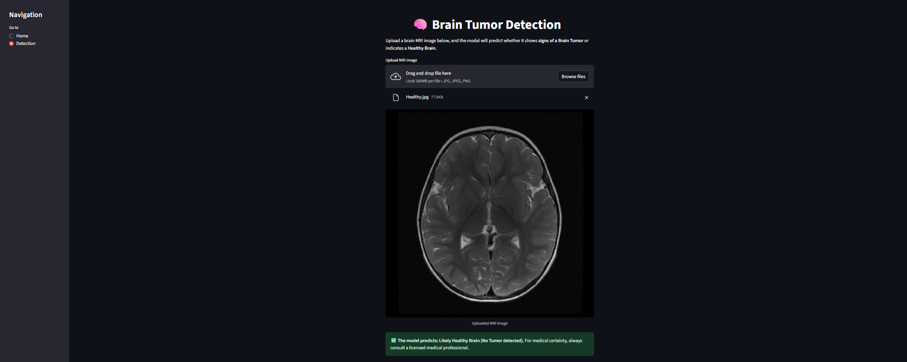

# **BrainTumorClassifier: InceptionV3-Based Brain Tumor Detection**

BrainTumorClassifier is a deep learning project that uses **transfer learning with InceptionV3** to classify MRI brain scans as **Brain Tumor** or **Healthy**.  
It demonstrates a complete **end-to-end computer vision workflow** including **dataset preparation, augmentation, InceptionV3 fine-tuning, evaluation, and deployment with Streamlit & Hugging Face**.

---

## **Demo**

- 🎥 [View LinkedIn Demo Post](https://www.linkedin.com/posts/rawan-alwadeya-17948a305_deeplearning-transferlearning-inceptionv3-activity-7374585631743643648-ittQ?utm_source=share&utm_medium=member_desktop)  
- 🌐 [Try the App Live on Streamlit](https://braintumorclassifier-txr6nwv9ep9gyqrfksedy3.streamlit.app/)  
- 🤗 [Explore on Hugging Face](https://huggingface.co/RawanAlwadeya/BrainTumorClassifier)

  
  

---

## **Project Overview**

The workflow includes:  
- **Dataset Preparation**: duplicate image removal, balanced train/validation/test splits  
- **Exploration & Visualization**: class distribution checks and image inspection  
- **Data Augmentation**: rotation, width/height shift, and zoom  
- **Modeling (InceptionV3)**: pre-trained on ImageNet, fine-tuned for binary classification  
- **Evaluation**: accuracy, precision, recall, and F1-score metrics  
- **Deployment**: interactive **Streamlit web app** and **Hugging Face Spaces** for real-time predictions

---

## **Objective**

Develop and deploy a robust **transfer learning model** to detect brain tumors early, providing an accessible AI-powered screening tool to assist radiologists and healthcare professionals.

---

## **Dataset**

- **Source**: [Brain Tumor MRI Dataset (Kaggle)](https://www.kaggle.com/datasets/preetviradiya/brian-tumor-dataset/data)  
- **Classes**: Brain Tumor, Healthy  
- **Preprocessing**:  
  - Duplicate images identified and removed  
  - Images resized to `(299×299)` RGB and normalized  
  - Dataset split into train/validation/test with balanced distributions  

---

## **Project Workflow**

- **EDA & Visualization**: analyzed class distribution and inspected sample images  
- **Preprocessing**:  
  - Resize to `(299×299)`  
  - RGB normalization `(0–1)`  
  - Balanced train/validation/test splits  
- **Augmentation**: random rotation, width/height shift, zoom  
- **Modeling (Transfer Learning)**:  
  - Base model: **InceptionV3** with ImageNet weights  
  - Custom layers: BatchNormalization, Dense with L1/L2 regularization, Dropout, Sigmoid output  
- **Training Setup**:  
  - Optimizer: **Adamax**  
  - Loss: Binary Crossentropy  
  - Callbacks: EarlyStopping, ModelCheckpoint, ReduceLROnPlateau  
  - Epochs: 30 (with early stopping)

---

## **Performance Results**

**InceptionV3 Transfer Learning Classifier:**  
- **Accuracy**: `98.04%`  
- **Precision**: `97.62%`  
- **Recall**: `98.09%`  
- **F1-score**: `97.85%`

The model achieved **high precision and recall**, ensuring reliable brain tumor detection while minimizing false positives.

---

## **Project Links**

- **Kaggle Notebook**: [View on Kaggle](https://www.kaggle.com/code/rawanalwadeya/braintumorclassifier-transfer-learning)  
- **Streamlit App**: [Try it Now](https://braintumorclassifier-txr6nwv9ep9gyqrfksedy3.streamlit.app/)  
- **Hugging Face Repo**: [Explore on Hugging Face](https://huggingface.co/RawanAlwadeya/BrainTumorClassifier)  

---

## **Tech Stack**

**Languages & Libraries**:  
- Python, Pandas, NumPy  
- TensorFlow / Keras, scikit-learn  
- Matplotlib, Seaborn  
- Streamlit (Deployment)

**Techniques**:  
- Transfer Learning (InceptionV3 fine-tuning)  
- Data Augmentation (rotation, shift, zoom)  
- EarlyStopping, ModelCheckpoint, ReduceLROnPlateau  
- Real-time deployment with **Streamlit** & **Hugging Face**

---
